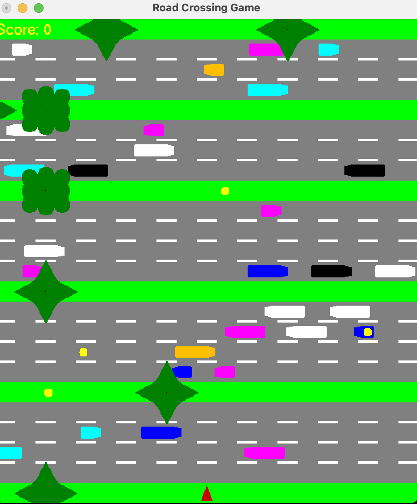

      [mini](mini) project for Computer Graphics class
      
  ---
  
# Road Crossing Game

A 2D arcade-style road crossing game built in C++ with OpenGL/GLUT and FMOD audio. The objective is to move forward, avoid traffic, collect coins, and survive as long as possible.
  
## screenshots




## Features

- Procedurally generated roads and pavements
- Moving traffic with varying directions and speeds
- Coin spawning and score tracking
- Sound effects and ambient audio using FMOD
- Game-over rules for collisions and illegal backward movement

## Controls

- `↑` move up
- `↓` move down
- `←` move left
- `→` move right
- `Middle Mouse` pause
- `Left Mouse` resume from pause
- `Right Mouse` advance one frame when paused
- `Q` quit

## Build and Run (macOS)

### Prerequisites

- C++ compiler with C++11 support (`g++`/`clang++`)
- OpenGL and GLUT
- OpenAL

You can install GLUT with Homebrew if needed:

```bash
brew install freeglut
```

### Commands

From the project root:

```bash
make
./roadcrossing
```

Or use:

```bash
make run
```

Clean build artifacts:

```bash
make clean
```

## Project Structure

- `source/` game implementation files
- `include/` headers and class definitions
- `media/` audio/assets
- `build/` generated object files
- `roadcrossing.sln` Visual Studio solution

## Gameplay Rules

- Score increases when moving forward.
- Colliding with vehicles ends the game.
- Attempting to reverse against your movement direction (outside start/end bounds) triggers game over.

## Screenshot


